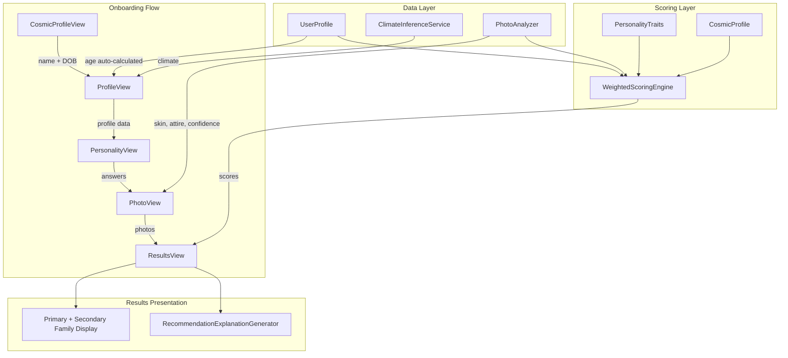

# Design Document: Onboarding Recommendation Revamp

## Overview

This design revamps the ScentDossier onboarding flow and recommendation engine across six key areas:

1. **Personality Traits Surfacing** — Prominently display numerology-derived personality traits (Life Path + Expression) in the Cosmic Profile step
2. **Auto-Calculate Age** — Derive age from the DOB entered in step 1, removing manual age input in the Profile step
3. **Auto-Infer Climate** — Map the user's location text to a climate classification, replacing the manual climate picker
4. **Remove "No Preference"** — Force explicit Budget and Fragrance Lean selections for more targeted filtering
5. **Dual Photo Upload** — Accept face + full-body photos, extracting skin colour, attire style, and confidence level
6. **Enhanced Scoring & Results** — Weighted multi-factor scoring (personality 0.35, climate 0.25, work 0.20, age 0.20), secondary scent family display, per-fragrance recommendation explanations, and photo analysis integration

The revamp touches `CosmicProfileView`, `ProfileView`, `PhotoView`, `ResultsView`, `ScoringEngine`, and `Models` while preserving the existing step flow orchestration in `ContentView`.

## Architecture



### High-Level Data Flow

1. User enters name + DOB → `CosmicProfileBuilder` computes numerology + zodiac → `PersonalityTraitsCard` renders traits prominently
2. Age is auto-computed from DOB and passed forward; location text triggers `ClimateInferenceService` with 1s debounce
3. Budget and Fragrance Lean require explicit selection (no "any" option)
4. Face + full-body photos are analyzed by `PhotoAnalyzer` (async, max 15s)
5. `WeightedScoringEngine` combines all dimensions with configurable weights, normalizes to 0–100
6. `ResultsView` shows primary + secondary families, and each fragrance card includes a generated explanation referencing the top-2 contributing dimensions

## Components and Interfaces

### 1. PersonalityTraitsCard (New SwiftUI View)

Displays Life Path and Expression traits prominently in `CosmicProfileView`.

```swift
struct PersonalityTraitsCard: View {
    let cosmicProfile: CosmicProfile
    
    // Displays:
    // - Life Path number + trait phrase + linked scent family + master number badge
    // - Expression number + trait phrase + linked scent family + master number badge
    // Visibility: hidden when cosmicProfile is nil (name empty or DOB not set)
    // Update latency: < 300ms (computed inline from CosmicProfileBuilder)
}
```

### 2. AgeCalculator (Utility)

```swift
enum AgeCalculator {
    /// Returns completed years (floored) between birthDate and current device date
    static func age(from birthDate: Date) -> Int
}
```

### 3. ClimateInferenceService (New Module)

```swift
protocol ClimateInferenceServiceProtocol {
    func inferClimate(from location: String) async throws -> ClimateClassification
}

enum ClimateClassification: String, CaseIterable {
    case hot, cold, temperate, humid, dry
}

struct ClimateInferenceService: ClimateInferenceServiceProtocol {
    // Uses a static mapping of known city/country keywords → climate
    // Falls back to a lightweight geocoding + climate-zone lookup
    // Timeout: 5 seconds max
    // Debounce: 1 second after user stops typing
    // Input validation: 2–100 characters
}
```

### 4. PhotoAnalyzer (New Module)

```swift
struct PhotoAnalysisResult {
    var skinColour: SkinColourClassification?  // from face photo
    var attireStyles: [String]?                 // 1–3 labels from full-body photo
    var confidenceLevel: ConfidenceLevel?       // from full-body photo
}

enum SkinColourClassification: String, CaseIterable, Codable {
    case fair, light, medium, olive, tan, dark, deep
}

enum ConfidenceLevel: String, CaseIterable, Codable {
    case low, moderate, high
}

protocol PhotoAnalyzerProtocol {
    func analyzeFacePhoto(_ image: UIImage) async throws -> SkinColourClassification
    func analyzeFullBodyPhoto(_ image: UIImage) async throws -> (attireStyles: [String], confidence: ConfidenceLevel)
}
```

### 5. WeightedScoringEngine (Replaces current ScoringEngine.scoreFamilies)

```swift
struct FactorWeights {
    var personality: Double = 0.35
    var climate: Double = 0.25
    var workStyle: Double = 0.20
    var age: Double = 0.20
    
    // Invariant: personality + climate + workStyle + age == 1.0
    // If a dimension is missing, redistribute its weight equally among remaining dimensions
}

extension ScoringEngine {
    static func weightedScoreFamilies(
        profile: UserProfile,
        traits: PersonalityTraits,
        cosmicProfile: CosmicProfile?,
        photoAnalysis: PhotoAnalysisResult?,
        weights: FactorWeights = FactorWeights()
    ) -> [String: Double]
    
    // Returns scores normalized to 0–100 scale (highest = 100, others proportional)
    // Age brackets: 18–29 → boost citrus/aquatic/fruity; 30–45 → floral/fougere/woody; 46+ → oriental/leather/gourmand
    // Photo integration: skin colour adds up to 3pts; attire replaces styling; confidence modifies boldness axis
}
```

### 6. RecommendationExplanationGenerator (New Module)

```swift
struct RecommendationExplanation {
    let text: String  // 1–3 sentences, plain language, no scores
}

enum RecommendationExplanationGenerator {
    static func generate(
        for fragrance: Fragrance,
        scores: DimensionContributions,
        allFragrances: [Fragrance]
    ) -> RecommendationExplanation
    
    // Selects top-2 contributing dimensions for that fragrance's family
    // Falls back to generic explanation if < 2 dimensions have non-zero contribution
    // Guarantees uniqueness: no two fragrances get identical text (uses fragrance-specific attributes)
}

struct DimensionContributions {
    let personality: Double
    let climate: Double
    let workStyle: Double
    let age: Double
    let photo: Double?
}
```

### 7. Updated PhotoView (Dual Upload)

```swift
struct PhotoView: View {
    // Two PhotosPicker slots: "Face Photo" and "Full-Body Photo"
    // Each independently selectable
    // Accepted formats: JPEG, PNG; max 10MB per photo
    // Analysis results displayed within 15s of upload
    // Error handling: display failure reason + retry option
    // User can proceed with 0, 1, or 2 photos
}
```

### 8. Updated ResultsView (Secondary Family + Explanations)

```swift
// Olfactory Signature section:
// - Primary Family: larger swatch + font, positioned left
// - Secondary Family: smaller swatch, positioned right
// - Deterministic tiebreaker: alphabetical by family ID for second-highest score ties

// Fragrance Card expanded section:
// - RecommendationExplanation visible without additional scrolling
// - Unique per card
```

## Data Models

### Extended UserProfile

```swift
struct UserProfile {
    // Existing fields...
    var climate: String = ""         // Now auto-inferred from location (or manual fallback)
    var location: String = ""
    var age: String = ""             // Now read-only, auto-calculated from birthDate
    var skin: String = ""
    var styling: String = ""
    var work: String = ""
    var budget: String = ""          // Changed default from "any" to "" (no pre-selection)
    var genderPref: String = ""      // Changed default from "any" to "" (no pre-selection)
    var season: String = ""
    var occasion: String = ""
    var currency: String = "USD"
    
    // Cosmic profile
    var cosmicName: String = ""
    var birthDate: Date?
    
    // Photo analysis results (new)
    var photoAnalysis: PhotoAnalysisResult?
    
    var isComplete: Bool {
        !age.isEmpty && !skin.isEmpty && !styling.isEmpty && !work.isEmpty &&
        !budget.isEmpty && !genderPref.isEmpty  // Budget and genderPref now required
    }
}
```

### PhotoAnalysisResult

```swift
struct PhotoAnalysisResult: Codable {
    var skinColour: SkinColourClassification?
    var attireStyles: [String]?       // 1–3 descriptive labels
    var confidenceLevel: ConfidenceLevel?
}
```

### FactorWeights

```swift
struct FactorWeights {
    var personality: Double = 0.35
    var climate: Double = 0.25
    var workStyle: Double = 0.20
    var age: Double = 0.20
    
    /// Redistributes missing dimension's weight equally among present dimensions
    func effective(
        hasPersonality: Bool,
        hasClimate: Bool,
        hasWorkStyle: Bool,
        hasAge: Bool
    ) -> FactorWeights
}
```

### Scoring Output

```swift
struct FamilyScore {
    let familyId: String
    let rawScore: Double
    let normalizedScore: Double  // 0–100 where max = 100
    let dimensionContributions: DimensionContributions
}
```

### Climate Mapping Data Structure

```swift
struct ClimateMapping {
    // Static dictionary mapping location keywords to ClimateClassification
    // Example: "mumbai" → .hot, "london" → .temperate, "dubai" → .hot
    static let mappings: [String: ClimateClassification]
}
```


## Correctness Properties

*A property is a characteristic or behavior that should hold true across all valid executions of a system — essentially, a formal statement about what the system should do. Properties serve as the bridge between human-readable specifications and machine-verifiable correctness guarantees.*

### Property 1: Cosmic profile computation completeness

*For any* valid name (1–50 characters containing at least one letter) and any valid birth date (in the past), `CosmicProfileBuilder.build()` SHALL produce a `CosmicProfile` where both `lifePathNumber` and `expressionNumber` are in {1–9, 11, 22}, both traits have non-empty descriptions, both traits reference a valid scent family ID from `allFamilies`, and `isMaster` is true if and only if the number is 11 or 22.

**Validates: Requirements 1.1, 1.2**

### Property 2: Invalid cosmic inputs produce nil profile

*For any* name string that contains zero letter characters (empty string, digits-only, symbols-only, whitespace-only) OR a nil birth date, the computed `cosmicProfile` property SHALL be nil.

**Validates: Requirements 1.4**

### Property 3: Age calculation correctness

*For any* birth date in the past and any reference date after the birth date, `AgeCalculator.age(from:)` SHALL return the number of fully completed years (floored), equivalent to `Calendar.dateComponents([.year], from: birthDate, to: referenceDate).year`.

**Validates: Requirements 2.1**

### Property 4: Climate inference returns valid classification

*For any* location string between 2 and 100 characters that matches a known mapping entry, `ClimateInferenceService.inferClimate(from:)` SHALL return exactly one value from `ClimateClassification` (hot, cold, temperate, humid, or dry).

**Validates: Requirements 3.1**

### Property 5: Scoring engine rejects invalid budget or fragrance lean

*For any* budget value not in {"1", "2", "3", "4"} OR any fragrance lean value not in {"feminine", "masculine", "unisex"}, the scoring engine SHALL reject the request and not produce recommendations.

**Validates: Requirements 4.4, 4.5, 4.6**

### Property 6: Top-2 family selection with deterministic tiebreaker

*For any* non-empty scores dictionary with at least two families, selecting the top-2 families SHALL return the family with the highest score as Primary and the family with the second-highest score as Secondary. When multiple families share the same second-highest score, the family with the alphabetically first ID SHALL be selected as Secondary.

**Validates: Requirements 6.1**

### Property 7: Factor weights always sum to 1.0 with redistribution

*For any* subset of present dimensions (at least one of personality, climate, workStyle, age), calling `FactorWeights.effective(...)` SHALL return weights that sum to 1.0 (within floating-point tolerance of ±0.0001), where each present dimension receives its base weight plus an equal share of absent dimensions' total weight.

**Validates: Requirements 7.1, 7.4**

### Property 8: Age bracket scoring correctness

*For any* age value in the range 18–100, the age-based scoring function SHALL boost exactly one bracket's families (18–29: citrus, aquatic, fruity; 30–45: floral, fougere, woody; 46+: oriental, leather, gourmand) with a score increment between 1 and 3 points per matching family, and SHALL add 0 age-based boost to families outside the active bracket.

**Validates: Requirements 7.2**

### Property 9: Weighted scoring formula correctness

*For any* set of raw dimension scores and valid factor weights (summing to 1.0), the final score for each scent family SHALL equal the sum of (dimension_raw_score × dimension_weight) across all present dimensions.

**Validates: Requirements 7.3**

### Property 10: Score normalization to 0–100

*For any* scores dictionary containing at least one positive value, after normalization the highest-scoring family SHALL have a score of exactly 100, all other families SHALL have scores in [0, 100], and the proportional relationships between scores SHALL be preserved (score_i / score_max = normalized_i / 100).

**Validates: Requirements 7.5**

### Property 11: Explanation references top-2 contributing dimensions

*For any* fragrance whose scent family has at least 2 dimensions with non-zero contribution, the generated `RecommendationExplanation` SHALL reference the names of the two dimensions with the highest individual score contribution. When fewer than 2 dimensions have non-zero contribution, the explanation SHALL be a generic fallback referencing the fragrance's scent family.

**Validates: Requirements 8.2**

### Property 12: Explanation format constraints

*For any* generated `RecommendationExplanation`, the text SHALL consist of 1 to 3 sentences, SHALL contain no numeric score values (no patterns matching decimal numbers or point values), and SHALL contain no internal technical terminology (e.g., "weight", "factor", "dimension score").

**Validates: Requirements 8.3**

### Property 13: Explanation uniqueness across fragrance set

*For any* set of 2 or more fragrances within the same results set, all generated `RecommendationExplanation` texts SHALL be pairwise distinct (no two identical strings).

**Validates: Requirements 8.5**

### Property 14: Skin colour scoring capped at 3 points

*For any* `SkinColourClassification` value, the score contribution applied to any single scent family SHALL be between 0 and 3 points inclusive.

**Validates: Requirements 9.1**

### Property 15: Photo attire replaces manual styling

*For any* profile where both a photo-derived attire style and a manually-selected aesthetic preference are available, the scoring engine SHALL use the photo-derived attire style for the styling dimension and SHALL disregard the manual aesthetic preference entirely, applying the same weight values.

**Validates: Requirements 9.2, 9.3**

### Property 16: Confidence level modifies boldness within bounds

*For any* boldness value in [0.0, 1.0] and any `ConfidenceLevel` (low, moderate, high), applying the confidence modifier SHALL produce a final boldness value that remains within [0.0, 1.0].

**Validates: Requirements 9.4**

### Property 17: Graceful degradation with missing or partial photo data

*For any* profile where `photoAnalysis` is nil or partially populated, the scoring engine SHALL incorporate whichever photo classifications are available, SHALL fall back to manual profile data for missing classifications, and SHALL apply no score reduction or penalty compared to a profile without any photo data.

**Validates: Requirements 9.5, 9.6**

## Error Handling

### Climate Inference Errors

| Condition | Behavior |
|-----------|----------|
| Location text < 2 or > 100 characters | Do not invoke service; show manual picker |
| Service returns no result | Show manual climate picker; preserve location text |
| Service times out (> 5 seconds) | Cancel request; show manual climate picker |
| Network unavailable | Show manual climate picker immediately |

### Photo Analysis Errors

| Condition | Behavior |
|-----------|----------|
| Photo exceeds 10MB | Reject upload; display size limit message |
| Unsupported format (not JPEG/PNG) | Reject upload; display format message |
| Analyzer fails to process image | Display failure reason; offer retry or skip |
| Partial analysis (some fields missing) | Use available data; fall back to manual for missing |
| Both photos fail | Proceed with no photo data; no penalty |

### Scoring Engine Errors

| Condition | Behavior |
|-----------|----------|
| Missing budget value (empty string) | Reject scoring request; require selection |
| Missing fragrance lean value | Reject scoring request; require selection |
| Invalid budget tier (not 1–4) | Reject scoring request |
| All dimension scores are zero | Return uniform scores (all families equal) |
| No fragrances match filters | Display empty state card with suggestion to widen filters |

### General Error Strategy

- All errors are non-fatal; the user can always continue through the flow
- Errors in optional steps (Photo, Climate inference) degrade gracefully without blocking
- Errors in required fields (Budget, Fragrance Lean) prevent forward navigation until resolved
- No crash-level assertions; all boundary conditions handled with fallback values

## Testing Strategy

### Unit Tests (Example-Based)

Focus on specific scenarios and edge cases:

- **CosmicProfileView**: Verify Personality Traits Card visibility toggles based on input validity
- **ProfileView**: Verify age label renders as read-only; verify no "No preference" options; verify Continue disabled without required selections
- **PhotoView**: Verify dual upload slots render; verify error messages on failure; verify user can always proceed
- **ResultsView**: Verify primary/secondary family visual distinction; verify explanation visible in expanded card
- **ClimateInferenceService**: Test known mappings (e.g., "Mumbai" → hot, "London" → temperate); test timeout fallback; test debounce behavior
- **PhotoAnalyzer**: Integration tests with sample images

### Property-Based Tests

Each correctness property above SHALL be implemented as a property-based test using [swift-testing](https://github.com/apple/swift-testing) with a custom property test harness (or SwiftCheck if available). Each test runs a minimum of **100 iterations** with randomized inputs.

**Test tagging format:**
```
// Feature: onboarding-recommendation-revamp, Property {N}: {title}
```

Key property test targets:

1. `CosmicProfileBuilder` — Properties 1, 2
2. `AgeCalculator` — Property 3
3. `ClimateInferenceService` — Property 4
4. `ScoringEngine` validation — Property 5
5. `topFamilies` with tiebreaker — Property 6
6. `FactorWeights.effective()` — Property 7
7. Age bracket scoring — Property 8
8. Weighted scoring formula — Property 9
9. Score normalization — Property 10
10. `RecommendationExplanationGenerator` — Properties 11, 12, 13
11. Photo scoring integration — Properties 14, 15, 16, 17

### Integration Tests

- Full onboarding flow end-to-end: Cosmic → Profile → Personality → Photo → Results
- Climate inference service with real mapping data
- Photo analysis pipeline with sample images
- Scoring engine with complete profile producing expected top families

### Test Configuration

- Property tests: minimum 100 iterations per property
- Timeout for async tests: 15 seconds (matching photo analysis SLA)
- All tests run in Xcode Test Navigator via `swift test` or Xcode scheme
